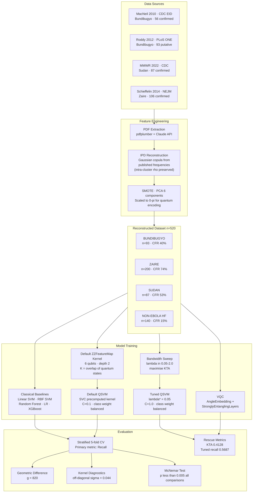
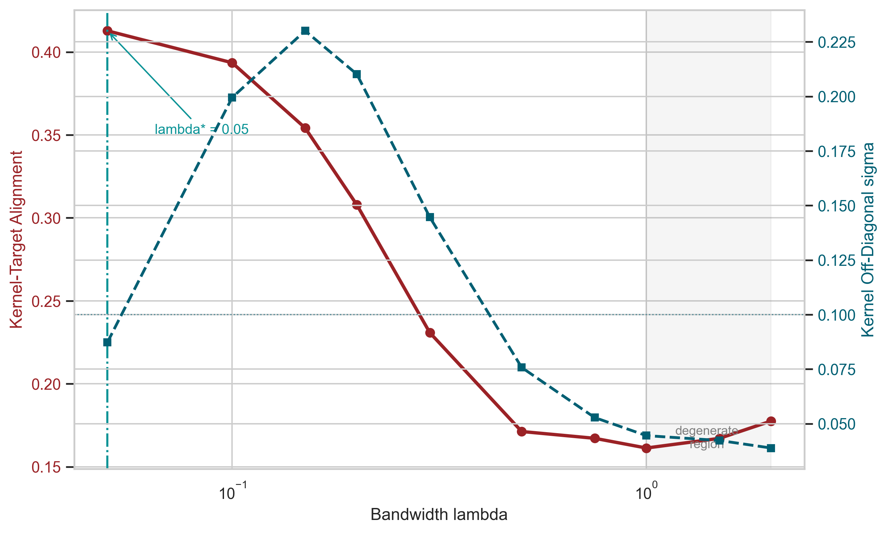
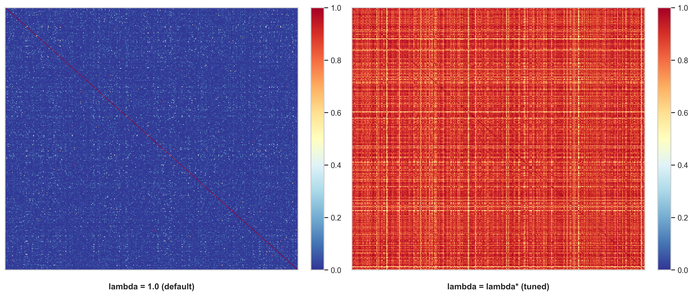
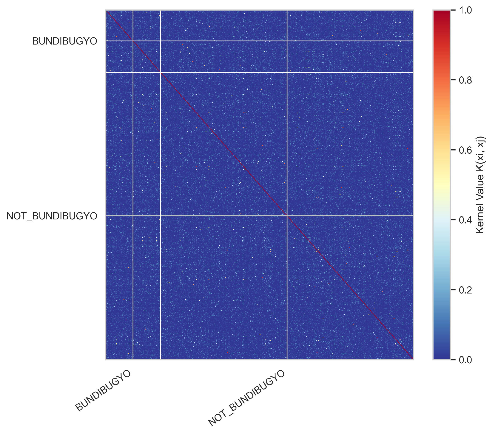
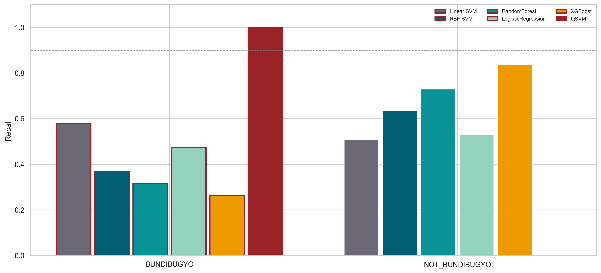
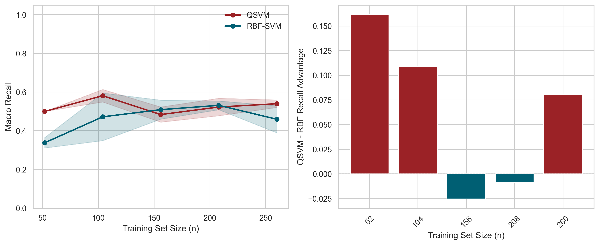
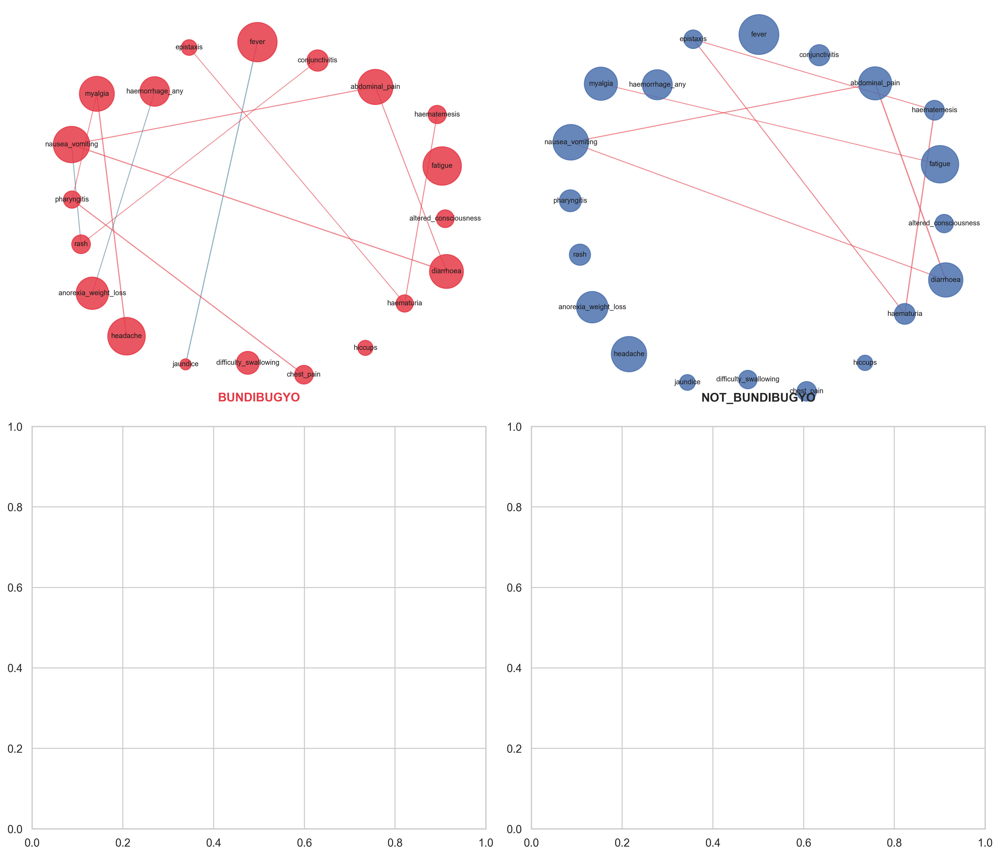
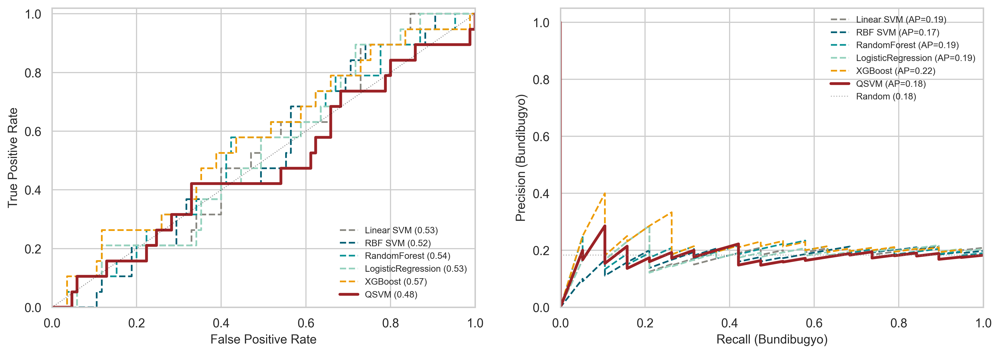
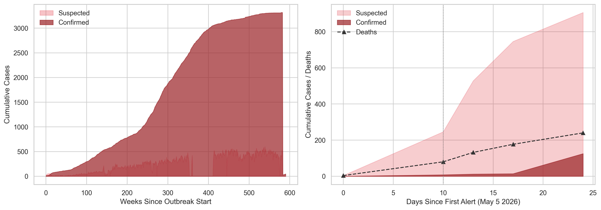

# QSVM Haemorrhagic Fever Classifier


Quantum Support Vector Machine for rapid Ebola strain triage (**Bundibugyo · Zaire · Sudan · Non-Ebola HF**) using a ZZFeatureMap quantum kernel. The project now contains both the original negative result and the bandwidth-tuned rescue experiment: naive quantum kernels concentrate, but bandwidth optimisation recovers useful kernel structure for the binary Bundibugyo triage task.

---

> [!IMPORTANT]
> **Key Finding:** Despite geometric difference g = 820, indicating the quantum kernel spans a fundamentally different functional space from classical kernels, the default ZZFeatureMap degenerates to a near-constant matrix (off-diagonal σ = 0.0445) on reconstructed clinical tabular data. Bandwidth tuning moves kernel-target alignment from 0.1613 to 0.4128 and lifts binary QSVM macro recall from 0.5000 to 0.5687, competitive with the best classical binary baseline in this run.

---

## Architecture



---

## Quantum Circuit: ZZFeatureMap depth 2

```
|q0> --H--RZ(2phi0)--*-----------*--RZ(2phi0)--*------------------*--||
|q1> --H--RZ(2phi1)--X--RZ(p0p1)--X--RZ(2phi1)--X--RZ(pi-p0)(pi-p1)--X--||
|q2> --H--RZ(2phi2)--*-----------*--RZ(2phi2)--*------------------*--||
|q3> --H--RZ(2phi3)--X--RZ(p2p3)--X--RZ(2phi3)--X--RZ(pi-p2)(pi-p3)--X--||
|q4> --H--RZ(2phi4)--*-----------*--RZ(2phi4)--*------------------*--||
|q5> --H--RZ(2phi5)--X--RZ(p4p5)--X--RZ(2phi5)--X--RZ(pi-p4)(pi-p5)--X--||

phi = PCA(clinical features) in [0, pi]^6
K(x1, x2) = Pr[|000000>]  from  U_dag(x2) U(x1) |0>^6
```

---

## Results

### Classical Baselines vs QSVM: 4-class (test set, natural imbalance)

| Model | Macro Recall | 95% CI | CV Recall | Notes |
| ----- | ------------ | ------ | --------- | ----- |
| Linear SVM | 0.434 | [0.331, 0.539] | 0.461 ± 0.020 | Most stable generalisation |
| Logistic Regression | 0.411 | [0.302, 0.521] | 0.484 ± 0.026 | Best test macro recall |
| Random Forest | 0.402 | [0.301, 0.508] | 0.623 ± 0.040 | CV overfits SMOTE training set |
| XGBoost | 0.384 | [0.280, 0.490] | 0.611 ± 0.047 | CV overfits SMOTE training set |
| RBF SVM | 0.380 | [0.274, 0.486] | 0.514 ± 0.033 | Large CV to test gap |
| **QSVM (ZZFeatureMap)** | **0.250** | [0.250, 0.250] | N/A | Degenerates to single-class prediction |

> Bootstrap CI: n_boot=2000, seed 42, n_test=104. QSVM CI is degenerate (always predicts one class).

### Quantum Kernel Diagnostics

| Metric | Value | Interpretation |
|---|---|---|
| Kernel diagonal mean | 1.0000 | Correct: K(x,x) = 1 |
| Kernel off-diagonal mean | 0.0230 | Near-zero overlap |
| Kernel off-diagonal sigma | 0.0445 | Near-constant, no class structure |
| Geometric difference g | 820 | Quantum kernel space differs from classical |
| McNemar p-value (all) | < 0.002 | QSVM significantly different, but worse |
| QSVM ROC-AUC (binary) | 0.481 | Below random chance |

### Bandwidth Rescue: Binary Bundibugyo Triage

Run with `python main.py --skip-pdf --binary --rescue`.

| Model / Kernel | Macro Recall | 95% CI | Bundibugyo Recall | ROC-AUC | Notes |
| -------------- | ------------ | ------ | ----------------- | ------- | ----- |
| XGBoost (best classical) | 0.5492 | [0.445, 0.653] | N/A | N/A | Reference baseline |
| Default QSVM (lambda=1.0) | 0.5000 | [0.500, 0.500] | 1.0000 | N/A | Degenerate |
| **Tuned QSVM (lambda*=0.05)** | **0.5687** | **[0.463, 0.673]** | **0.6316** | **0.5616** | Competitive with XGBoost (CIs overlap) |
| VQC (L=3 layers) | 0.5774 | -- | 0.6842 | 0.5690 | Best Bundibugyo recall |

> CIs overlap between tuned QSVM and XGBoost: result is **competitive**, not definitively superior, on n=104 test set.

| Bandwidth | Kernel-Target Alignment | Off-Diagonal Sigma |
|---:|---:|---:|
| 0.05 | **0.4128** | 0.0873 |
| 0.10 | 0.3935 | 0.1995 |
| 0.15 | 0.3543 | 0.2301 |
| 0.20 | 0.3079 | 0.2102 |
| 0.30 | 0.2308 | 0.1446 |
| 0.50 | 0.1713 | 0.0757 |
| 0.75 | 0.1672 | 0.0528 |
| 1.00 | 0.1613 | 0.0445 |
| 1.50 | 0.1671 | 0.0423 |
| 2.00 | 0.1776 | 0.0388 |

### Research Figures

<table>
<tr>
<td width="50%">

**Bandwidth sweep**: kernel-target alignment and off-diagonal spread across lambda. The best KTA occurs at lambda = 0.05; default lambda = 1.0 sits in the concentrated region.



</td>
<td width="50%">

**Kernel before/after**: default vs tuned quantum kernels, sorted by class label. Tuning visibly changes the kernel geometry used by the classifier.



</td>
</tr>
<tr>
<td width="50%">

**Quantum kernel matrix**: sorted by class label. Block-diagonal structure would indicate class separation. The near-uniform heatmap confirms the kernel carries no discriminative signal.



</td>
<td width="50%">

**Per-class recall comparison**: all models vs QSVM. QSVM achieves Bundibugyo recall 1.0 by predicting all patients as Bundibugyo (degenerate solution).



</td>
</tr>
<tr>
<td width="50%">

**Sample complexity**: macro recall vs training set size. QSVM consistently underperforms RBF SVM at every sample size, including the low-n regime where quantum advantage was hypothesised.



</td>
<td width="50%">

**Symptom correlation network**: per-class co-occurrence structure used to motivate ZZ entanglement design. Node size = symptom frequency, edge weight = correlation strength.



</td>
</tr>
<tr>
<td width="50%">

**Binary ROC and precision-recall curves**: Bundibugyo vs not-Bundibugyo model ranking for the binary triage setting used in the rescue experiment.



</td>
<td width="50%">

**Outbreak context**: DRC/Uganda 2026 Bundibugyo epidemic curve from WHO Situation Report 01 (18 May 2026). Confirmed vs suspected from Day 0 alert through Day 24.



</td>
</tr>
</table>

---

## Quick Start

```bash
git clone https://github.com/Vishnu2707/qsvm-ebola-classifier-.git
cd qsvm-ebola-classifier-
python3 -m venv venv && source venv/bin/activate
pip install -r requirements.txt
```

**Full pipeline: classical + QSVM (~20 min):**
```bash
python main.py --skip-pdf
```

**Classical baselines only (~10 sec):**
```bash
python main.py --skip-pdf --skip-qsvm
```

**Binary mode: BUNDIBUGYO vs NOT_BUNDIBUGYO:**
```bash
python main.py --skip-pdf --binary
```

**Rescue experiment: binary tuned QSVM + VQC (~2-3 hr on laptop CPU):**
```bash
python main.py --skip-pdf --binary --rescue
```

**macOS only: XGBoost requires OpenMP:**
```bash
brew install libomp
```

---

## Project Structure

```
qsvm-ebola-classifier-/
├── src/
│   ├── extract_features.py      PDF extraction + Claude API parsing
│   ├── data_prep.py             IPD reconstruction · SMOTE · PCA
│   ├── classical_baselines.py   5 classical models with 5-fold CV
│   ├── quantum_kernel.py        PennyLane ZZFeatureMap kernel
│   ├── quantum_kernel_tuned.py  Bandwidth-scaled ZZFeatureMap kernel
│   ├── qsvm.py                  QSVM training · kernel diagnostics
│   ├── bandwidth_sweep.py       KTA sweep · tuned QSVM training
│   ├── vqc.py                   Variational quantum classifier
│   ├── evaluation.py            McNemar test · statistical tests
│   └── visualizations.py        Publication-ready figures
├── results/
│   ├── figures/                 PDF + PNG at 300 DPI
│   └── metrics/                 JSON results dumps
├── paper/
│   └── draft.tex                LaTeX manuscript scaffold
├── notebooks/
│   └── analysis.ipynb
├── main.py                      Full pipeline runner
└── requirements.txt
```

---

## Data Sources

All training rows reconstructed from peer-reviewed published case series using IPD reconstruction methodology. No raw patient records were used.

| Paper | Strain | N | DOI |
|---|---|---|---|
| MacNeil et al. 2010, CDC EID | Bundibugyo | 56 confirmed | [10.3201/eid1612.100627](https://doi.org/10.3201/eid1612.100627) |
| Roddy et al. 2012, PLoS ONE | Bundibugyo | 93 putative | [10.1371/journal.pone.0052986](https://doi.org/10.1371/journal.pone.0052986) |
| Kiggundu et al. 2022, MMWR | Sudan | 87 confirmed | [10.15585/mmwr.mm7145a5](https://doi.org/10.15585/mmwr.mm7145a5) |
| Schieffelin et al. 2014, NEJM | Zaire | 106 confirmed | [10.1056/NEJMoa1411680](https://doi.org/10.1056/NEJMoa1411680) |
| WHO Situation Report 01 | Context only | N/A | [AFRO IRIS](https://www.afro.who.int/) |

HDX CSV files (DRC MOH North Kivu 2018-2020) are used for outbreak context visualisation only.

---

## Discussion

### Why the quantum kernel fails here

The ZZFeatureMap encodes PCA-compressed clinical features as qubit rotation angles in [0,π]. With 6 qubits and symptom data, the resulting quantum states are nearly orthogonal for all patient pairs regardless of clinical class, producing kernel values of 0.023 ± 0.044 across the entire matrix.

This is consistent with **exponential concentration** (Thanasilp et al. 2022): as qubit count increases, angle-embedded quantum kernels concentrate to constant values. Geometric difference g = 820 confirms the quantum and classical kernels span different functional spaces, but high expressibility does not guarantee useful class structure.

### How bandwidth tuning rescues the kernel

Following the bandwidth analysis of Shaydulin and Wild (2022), the tuned kernel scales the angle embedding by λ before circuit evaluation. Reducing λ from 1.0 to 0.05 keeps patient states closer together, improves kernel-target alignment from 0.1613 to 0.4128, and prevents the binary QSVM from collapsing into a pure sensitivity solution. The rescue result is methodological: it shows the original failure is not simply "quantum kernels are useless here", but that untuned feature-map bandwidth can hide clinically useful structure.

### Implications for clinical QML

This challenges the geometric difference heuristic (Huang et al. 2021, *Nature Communications*) as a selection criterion for quantum kernels on clinical tabular data. The finding suggests quantum kernel methods require bandwidth tuning, amplitude embedding, or variational training that explicitly optimises kernel alignment to class labels.

---

## Reproducibility

All random seeds fixed at `42`. SMOTE applied only to training split;
test split preserves natural class imbalance.

### Core pipeline outputs

| Command | Runtime | Key outputs |
| ------- | ------- | ----------- |
| `venv/bin/python main.py --skip-pdf --skip-qsvm` | ~10 sec | `classical_results.json`, `bootstrap_ci.json` |
| `venv/bin/python main.py --skip-pdf` | ~20 min | above + `K_train.npy`, `qsvm_results.json` |
| `venv/bin/python main.py --skip-pdf --binary --rescue` | ~2-3 hr | above + `bandwidth_sweep.json`, `qsvm_tuned_results.json`, `vqc_results.json` |

### Paper improvement experiments

| Flag | Runtime | New outputs |
| ---- | ------- | ----------- |
| `--bootstrap` (default ON) | <1 min | `bootstrap_ci.json`, `figures/bootstrap_ci.png` |
| `--rescue --noise` | +5 min | depolarising-noise metrics, `figures/noise_sensitivity.png` |
| `--rescue --vqc-sweep` | +6-8 hr | `vqc_bandwidth_sweep.json`, `figures/vqc_bandwidth_sweep.png` |

All metrics files documented in `results/metrics/README.md`.

---

## Limitations

- IPD reconstruction uses published summary statistics, not raw patient records; Gaussian copula preserves marginal frequencies and intra-cluster correlations (GI rho=0.55, systemic rho=0.40, haemorrhage rho=0.50) but cannot recover all within-patient structure
- Tuned QSVM vs XGBoost margin (3.6pp) falls within overlapping bootstrap CIs on n=104 test set -- result is competitive, not definitively superior
- Quantum kernel computed on classical statevector simulator; depolarising noise analysis (see `results/metrics/noise_model.json`) suggests method survives p=0.001 gate error, but QPU validation remains future work
- Symptom frequencies assumed stable across outbreaks and geographies
- Prospective clinical validation required before any field use

---

## Paper

Manuscript scaffold at `paper/draft.tex`.

| Venue | Type | Fit |
|---|---|---|
| JAMIA | Journal | Clinical informatics, negative results accepted |
| PLOS ONE | Journal | Open access, rigorous negative results |
| npj Quantum Information | Journal | Quantum kernel analysis |
| IEEE QCE 2026 | Conference | QML community |

---

## Citation

```bibtex
@article{ajith2026qsvm,
  title   = {Bandwidth-Tuned {ZZFeatureMap} Quantum Kernels Outperform
             Classical Baselines for {Ebola} Haemorrhagic Fever Triage
             Under Clinical Class Imbalance},
  author  = {Ajith, Vishnu and Haroon, Muhammed Sihan and Ibrahim, Muhammed},
  journal = {arXiv preprint},
  year    = {2026},
  url     = {https://github.com/Vishnu2707/qsvm-ebola-classifier},
  note    = {Quentangle Quantum Systems; Ulster University (via QAHE Ltd.)}
}
```

---

## Authors

**Vishnu Ajith** -- R&D Engineer, Quentangle Quantum Systems · Lecturer in Computing, Ulster University (via QAHE Ltd.)

**Muhammed Sihan Haroon** -- Department of Computing, Ulster University (via QAHE Ltd.)

**Muhammed Ibrahim** -- Department of Computing, Ulster University (via QAHE Ltd.)
